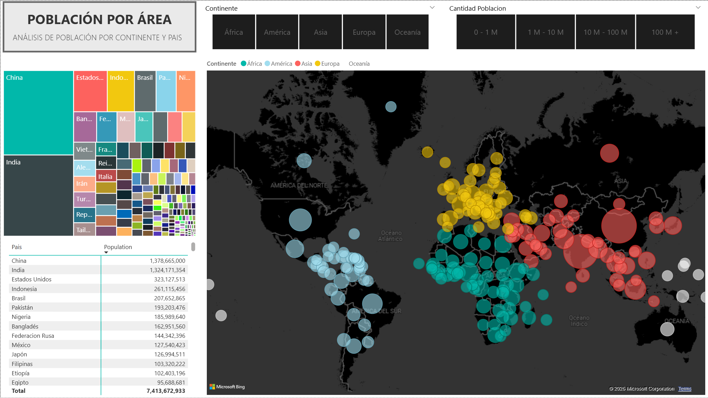
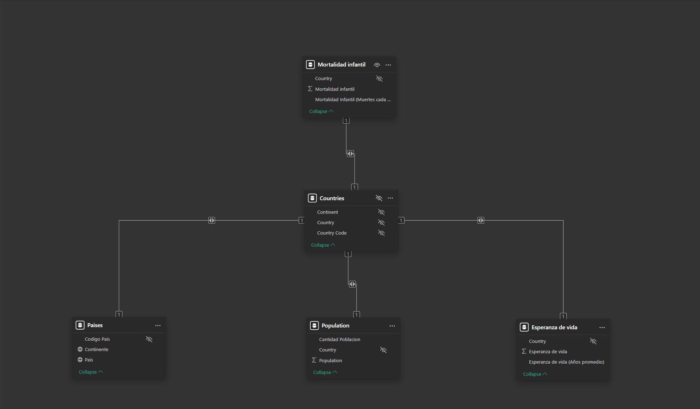

# 🌍 Global Health & Population Analysis

### 📊 Project Overview
This project is an advanced Data Analysis simulation exploring the relationship between **Socioeconomic Development** and **Public Health** globally.

Using **Power BI**, I built an interactive dashboard that allows users to visualize population distribution and analyze the statistical correlation between **Life Expectancy** and **Infant Mortality**. The report features a custom "Dark Mode" UI for high-contrast monitoring and utilizes Drill-Through features for granular navigation.

---

### 🖼️ Visual Tour & Analysis

#### 1. Global Demographics (Macro View)
*An interactive geospatial overview of world population density. Designed with a custom dark theme to highlight data clusters effectively.*

#### 2. Statistical Correlation (The Insight)
*Scatter plot analysis revealing the strong inverse correlation between Infant Mortality (X-axis) and Life Expectancy (Y-axis). By visualizing all countries simultaneously, we can identify clear development trends and regional clusters.*

#### 3. Data Engineering (The Backend)
*A robust Data Model (Star Schema) connecting Fact Tables with Dimensions. This structure ensures high-performance filtering and accurate cross-report connections.*

---

### 🚀 Key Technical Features
* **Drill-Through Navigation:** Engineered a seamless user journey, allowing detailed inspection from the World Map directly to specific Country Health indicators.
* **Correlation Analysis:** Used scatter plots to visually demonstrate how healthcare improvements impact longevity.
* **DAX & Modeling:** Implemented complex measures for time-intelligence and managed relationships between multiple datasets.
* **UI/UX Design:** Custom color palette and layout focused on readability and professional data storytelling.

### 🛠️ Tools Used
* **Microsoft Power BI**
* **Power Query** (ETL Process)
* **DAX** (Data Analysis Expressions)

---

### 📚 Acknowledgments
* **Data Source:** Gapminder (Global Health & Economics Data).
* **Inspiration:** Project based on **Javier Gómez's** Power BI course, adapted with custom UI/UX and advanced modeling.

---
*Developed by Eduardo Rosas - January 2026*
